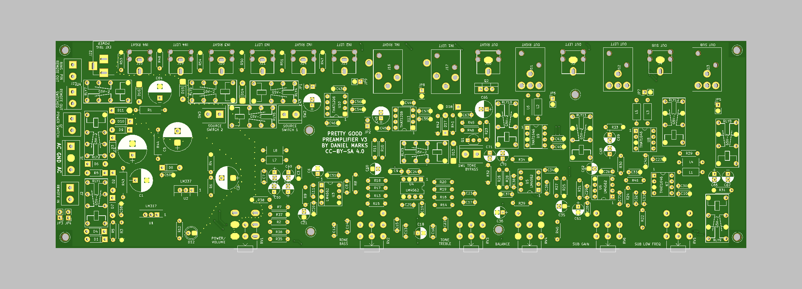

# Pretty Good Preamplifier

This is a stereo preamplifier circuit designed by Daniel Marks, including schematic and gerbers.

It has the following features:

1.  Four selectable audio sources, selected by relays.
2.  Bass and treble tone control (Baxandall tone control).
3.  Balance control.
4.  A subwoofer output with adjustable gain and corner frequency between 20 and 100 Hz.
5.  Unbalanced and balanced (XLR) outputs for stereo and subwoofer channels.
6.  Supports a toggle power switch or a volume knob power switch.
7.  Can be turned on using remote trigger.
8.  Can send a remote trigger signal when turned on (for example to an amplifier).

It is a two-sided PCB and liberally uses dual wiper potentiometers.  The LM4562 is preferentially used for the op-amps, but NE5532 works fine too.

